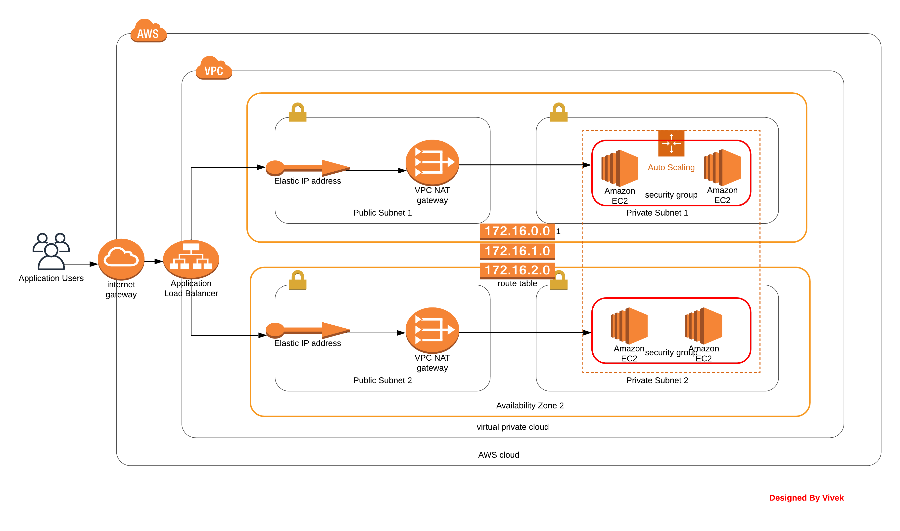

URL - http://udaci-webap-1r3ed4hhbp9hu-970594242.us-west-2.elb.amazonaws.com/

## Instructions

There are 2 Cloudformation scripts - **network.yml** and **servers.yml**

For deploy the stack just run: 

Create Network Stack - sh create-stack.sh udacity-nanodegree-project2-network network.yml network-parameters.json
    
Create Server Stack - sh create-stack.sh udacity-nanodegree-project2-server servers.yml servers-parameters.json

Update Network Stack - sh update-stack.sh udacity-nanodegree-project2-network network.yml network-parameters.json

Update Server Stackupdate - sh stack.sh udacity-nanodegree-project2-server servers.yml servers-parameters.json

Delete Network Stack - sh delete-stack.sh udacity-nanodegree-project2-network

Delete Server Stack - sh delete-stack.sh udacity-nanodegree-project2-server

## Architecture Diagram

